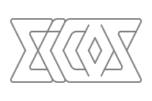
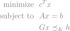
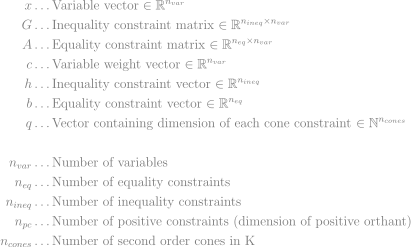
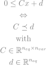
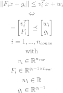

# Eigen Conic Solver

A C++ Second Order Cone Solver for problems of the form

<!--
\begin{aligned} 
\text{minimize} \ \ &c^T x \\
\text{subject to} \ \ &Ax = b \\
&Gx \preceq_K h
\end{aligend}
-->


<!-- 
\begin{align*}
x & \dots\text{Variable vector} \in \mathbb{R}^{n_{var}} \\
G & \dots\text{Inequality constraint matrix} \in \mathbb{R}^{n_{ineq} \times n_{var}} \\
A & \dots\text{Equality constraint matrix} \in \mathbb{R}^{n_{eq} \times n_{var}} \\
c & \dots\text{Variable weight vector} \in \mathbb{R}^{n_{var}} \\
h & \dots\text{Inequality constraint vector} \in \mathbb{R}^{n_{ineq}} \\
b & \dots\text{Equality constraint vector} \in \mathbb{R}^{n_{eq}} \\
q & \dots\text{Vector containing dimension of each cone constraint} \in \mathbb{N}^{n_{cones}} \\\\
n_{var} & \dots\text{Number of variables} \\
n_{eq} & \dots\text{Number of equality constraints} \\
n_{ineq} & \dots\text{Number of inequality constraints} \\
n_{pc} & \dots\text{Number of positive constraints (dimension of positive orthant)} \\
n_{cones} & \dots\text{Number of second order cones in K} \\
\end{align*}
-->


The last constraint is generalized and includes both the positive orthant and second order cones, so that the top rows of `G` represent the linear constraints
<!--
\begin{gathered}
Cx \leq d \\
\Leftrightarrow \\
C \preceq d \\
\text{with} \\
C \in \mathbb{R}^{n_{eq} \times n_{var}} \\
d \in \mathbb{R}^{n_{eq}} \\
\end{gathered}
-->


and the remaining rows contain stacked representations of the second order cones:
<!--
\begin{gathered}
\lVert F_ix + g_i \rVert \leq v_i^T x + w_i \\
\Leftrightarrow \\
-\begin{bmatrix} v_i^T \\ F_i \end{bmatrix} \preceq \begin{bmatrix} w_i \\ g_i \end{bmatrix} \\
i = 1,...,n_{cones}
\\
\text{with} \\
v_i \in \mathbb{R}^{n_{var}} \\
F_i \in \mathbb{R}^{q_i-1 \times n_{var}} \\
w_i \in \mathbb{R} \\
g_i \in \mathbb{R}^{q_i-1} \\
\end{gathered}
-->


### Usage
```cpp
#include "eicos.hpp"

Eigen::SparseMatrix<double> G, A;
Eigen::VectorXd c, h, b;
Eigen::VectorXi q;

// (Set up problem data)

// Construct a solver instance
EiCOS::Solver solver(G, A, c, h, b, q);

// Solve the problem
solver.solve()

// Save the solution
Eigen::VectorXd s = solver.solution();

// (Change entries in G, A, c, h, b)

// Update problem data: Using this method instead of constructing a new problem can
// save a lot of time, especially for larger problems. The only restriction is that 
// the sparsity pattern and dimensions must be the same as in the original problem.
solver.updateData(G, A, c, h, b);

// Rinse and repeat
solver.solve()

```

### Dependencies
* `Eigen` for linear algebra functionality
* `fmt` (optional) for printing and formatting

### Credits
This solver is entirely based on [ECOS](https://github.com/embotech/ecos).

* Alexander Domahidi (ECOS principal developer)
* Eric Chu (ECOS unit tests)
* Stephen Boyd (methods and maths)
